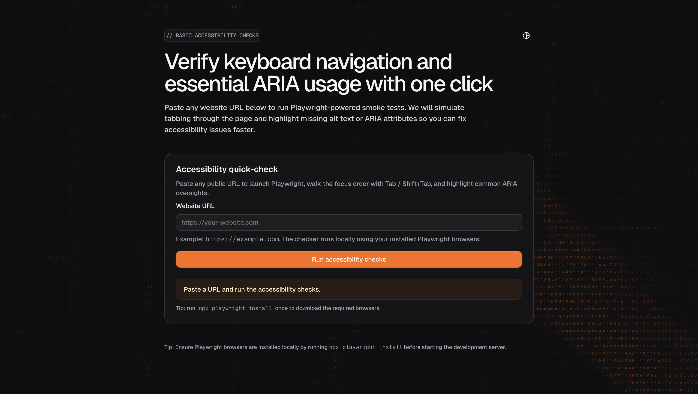

# ARIA - Accessibility Checker 🎯

[](https://nextjs.org/)
[](https://playwright.dev/)
[](https://www.typescriptlang.org/)
[](https://opensource.org/licenses/MIT)

An automated web accessibility testing tool powered by Playwright. Check tab order, ARIA attributes, keyboard navigation, and more for any website.



## ✨ Features

- 🎯 **Tab Order Analysis** - Automated keyboard navigation testing with Tab and Shift+Tab
- ♿ **ARIA Validation** - Comprehensive checks for ARIA attributes and landmarks
- 🖼️ **Image Accessibility** - Validates alt text and decorative image handling
- 🎨 **Beautiful UI** - Modern interface with ASCII art background and dark/light mode
- ⚡ **Real-time Results** - Instant feedback with detailed accessibility reports
- 🔍 **CSS Selectors** - Precise element identification for easy debugging
- 📊 **Comprehensive Reports** - Tab order verification, ARIA roles, and accessibility tree analysis

## 🚀 Getting Started

### Prerequisites

- Node.js 18+ 
- npm, yarn, pnpm, or bun

### Installation

1. Clone the repository:

```bash
git clone https://github.com/yourusername/aria-project.git
cd aria-project
```

2. Install dependencies:

```bash
npm install
# or
yarn install
# or
pnpm install
```

3. Install Playwright browsers:

```bash
npx playwright install
```

4. Run the development server:

```bash
npm run dev
# or
yarn dev
# or
pnpm dev
```

5. Open [http://localhost:3000](http://localhost:3000) in your browser

## 📖 Usage

1. **Enter a URL** - Paste any website URL into the input field
2. **Run Check** - Click "Check Accessibility" to start the analysis
3. **View Results** - Review the detailed accessibility report including:
   - Tab order sequence and verification
   - ARIA attributes and roles
   - Image alt text validation
   - Keyboard navigation issues

### Example

```typescript
// The tool automatically checks:
// ✓ Tab order follows logical flow
// ✓ All interactive elements are keyboard accessible
// ✓ ARIA labels and roles are properly implemented
// ✓ Images have appropriate alt text
// ✓ Focus indicators are visible
```

## 🛠️ Tech Stack

- **Framework**: [Next.js 16](https://nextjs.org/) (App Router)
- **Language**: [TypeScript](https://www.typescriptlang.org/)
- **Testing**: [Playwright](https://playwright.dev/)
- **Styling**: [Tailwind CSS v4](https://tailwindcss.com/)
- **UI Components**: Custom components with [Base UI](https://base-ui.com/)
- **Theme**: [next-themes](https://github.com/pacocoursey/next-themes)
- **Icons**: [Lucide React](https://lucide.dev/)

## 🎨 ASCII Background Component

The project features a fully customizable ASCII art background component with:

- **12+ Props** for complete customization
- **Theme-aware** colors with automatic LAB/OKLCH color conversion
- **Interactive cursor** effects with smooth gradients
- **Animation support** with configurable intervals
- **Image processing** with brightness, contrast, and blur controls
- **5 ASCII character sets**: Detailed, Standard, Blocks, Binary, Hex
- **Glow effects** and inversion support

### ASCII Component Props

```typescript
<AsciiBackground 
  image="/image.png"              // Image source for ASCII generation
  cursor={true}                   // Enable cursor hover effects
  color1="#fff"                   // Primary color (supports CSS vars)
  color2="#78BBFF"                // Secondary color
  glow={true}                     // Enable text glow
  glowSize={12}                   // Glow radius in pixels
  static={false}                  // Enable character animation
  animationInterval={0.15}        // Animation speed in seconds
  width={160}                     // Characters per line (20-150)
  asciiSet="detailed"             // Character set to use
  invert={true}                   // Invert brightness
  brightness={40}                 // Brightness adjustment (-100 to 100)
  contrast={-50}                  // Contrast adjustment (-100 to 100)
  blur={0}                        // Image blur in pixels
  cursorRadius={45}               // Cursor effect radius
  cursorSmoothness={40}           // Cursor gradient smoothness
  cursorIntensity={40}            // Cursor brightness boost
/>
```

## 🔧 Configuration

### Environment Variables

Create a `.env.local` file in the root directory:

```env
# Add any environment variables here
NEXT_PUBLIC_APP_URL=https://aria-check.vercel.app
```

### Tailwind Configuration

The project uses Tailwind CSS v4 with custom theme configuration in `app/globals.css`:

```css
@theme {
  --font-sans: Geist Sans;
  --font-mono: Geist Mono;
  --color-foreground: lab(96.1634% .0993311 -.364041);
  /* ... more theme variables */
}
```

## 📁 Project Structure

```
aria-project/
├── app/
│   ├── layout.tsx           # Root layout with SEO and theme
│   ├── page.tsx             # Home page
│   └── globals.css          # Global styles and Tailwind config
├── components/
│   ├── AccessibilityChecker.tsx  # Main checker component
│   ├── AsciiBackground.tsx       # ASCII art background
│   ├── ui/                       # Reusable UI components
│   └── theme-provider.tsx        # Theme context provider
├── lib/
│   ├── actions.ts           # Server actions for Playwright
│   └── utils.ts             # Utility functions
├── public/
│   └── image.png            # ASCII background source image
└── package.json
```

## 🧪 Testing

The accessibility checks are performed using Playwright's automation capabilities:

- **Tab Order**: Simulates Tab and Shift+Tab key presses to verify navigation
- **ARIA Analysis**: Extracts and validates ARIA attributes from the accessibility tree
- **Element Selection**: Generates CSS selectors for precise element identification
- **Cross-browser**: Can be extended to test across Chromium, Firefox, and WebKit

## 🤝 Contributing

Contributions are welcome! Please feel free to submit a Pull Request.

1. Fork the repository
2. Create your feature branch (`git checkout -b feature/AmazingFeature`)
3. Commit your changes (`git commit -m 'Add some AmazingFeature'`)
4. Push to the branch (`git push origin feature/AmazingFeature`)
5. Open a Pull Request

## 📝 License

This project is licensed under the MIT License - see the [LICENSE](LICENSE) file for details.

## 🙏 Acknowledgments

- Built with [Next.js](https://nextjs.org/)
- Powered by [Playwright](https://playwright.dev/)
- Inspired by [WCAG 2.1 Guidelines](https://www.w3.org/WAI/WCAG21/quickref/)
- Icons by [Lucide](https://lucide.dev/)

## 🔗 Links

- **Live Demo**: [https://aria-check.vercel.app](https://aria-check.vercel.app)
- **Documentation**: Coming soon
- **Report Issues**: [GitHub Issues](https://github.com/yourusername/aria-project/issues)

## 📧 Contact

For questions or feedback, please open an issue on GitHub.

---

Made with ❤️ for better web accessibility
